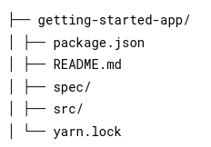
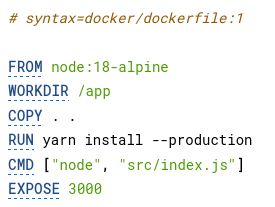
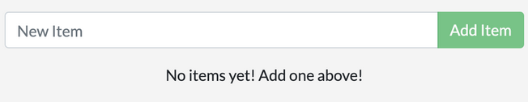
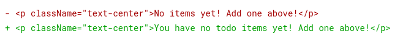
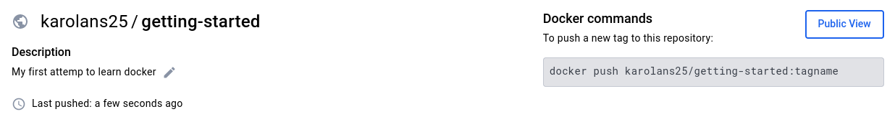
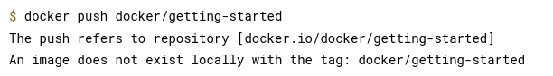
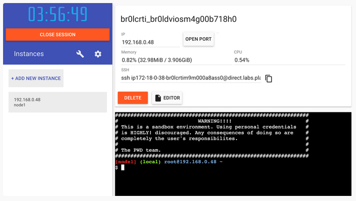
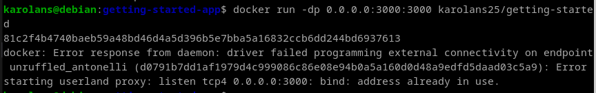
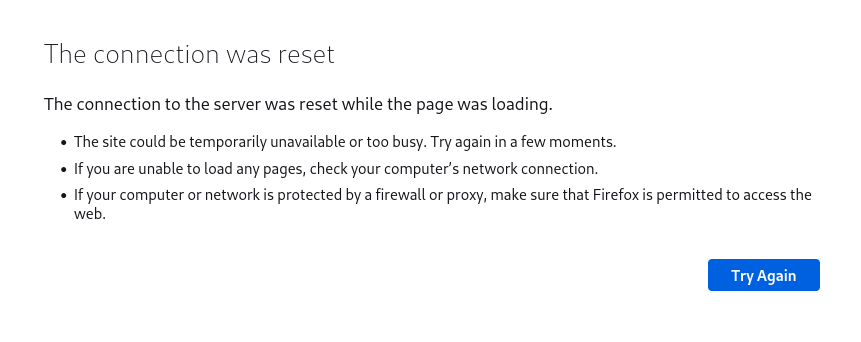

# Let's start with the first App with docker

## Get the app

1. Clone the getting-started-app repository using the following command:

`git clone https://github.com/docker/getting-started-app.git`

2. View the contents of the cloned repository. You should see the following files and sub-directories.

## Build the app's image

To build the image, you'll need to use a Dockerfile. A Dockerfile is simply a text-based file with no file extension that contains a script of instructions. Docker uses this script to build a container image.

1. In the `getting-started-app` directory, the same location as the `package.json` file, create a file named `Dockerfile`. You can use the following commands to create a Dockerfile based on your operating system.

**Linux & Mac:**

In the terminal, run the following commands. Make sure you're in the `getting-started-app` directory. Replace `/path/to/getting-started-app` with the path to your `getting-started-app` directory.

`cd /path/to/getting-started-app`

Create an empty file named `Dockerfile`.

`touch Dockerfile`

2. Using a text editor or code editor, add the following contents to the Dockerfile:

<!-- # syntax=docker/dockerfile:1

FROM node:18-alpine
WORKDIR /app
COPY . .
RUN yarn install --production
CMD ["node", "src/index.js"]
EXPOSE 3000 -->

3. Build the image using the following commands:

In the terminal, make sure you're in the `getting-started-app` directory. Replace `/path/to/getting-started-app` with the path to your `getting-started-app` directory.

`cd /path/to/getting-started-app`

Build the image.

`docker build -t getting-started .`

The docker build command uses the Dockerfile to build a new image. You might have noticed that Docker downloaded a lot of "layers". This is because you instructed the builder that you wanted to start from the node:18-alpine image. But, since you didn't have that on your machine, Docker needed to download the image.

After Docker downloaded the image, the instructions from the Dockerfile copied in your application and used yarn to install your application's dependencies. The CMD directive specifies the default command to run when starting a container from this image.

Finally, the -t flag tags your image. Think of this as a human-readable name for the final image. Since you named the image getting-started, you can refer to that image when you run a container.

The . at the end of the docker build command tells Docker that it should look for the Dockerfile in the current directory.

## Start an app container

Now that you have an image, you can run the application in a container using the docker run command.

1. Run your container using the `docker run` command and specify the name of the image you just created:

`docker run -dp 127.0.0.1:3000:3000 getting-started`

The -d flag (short for --detach) runs the container in the background. The -p flag (short for --publish) creates a port mapping between the host and the container. The -p flag takes a string value in the format of HOST:CONTAINER, where HOST is the address on the host, and CONTAINER is the port on the container. The command publishes the container's port 3000 to 127.0.0.1:3000 (localhost:3000) on the host. Without the port mapping, you wouldn't be able to access the application from the host.

2. After a few seconds, open your web browser to http://localhost:3000. You should see your app.

3. Add an item or two and see that it works as you expect. You can mark items as complete and remove them. Your frontend is successfully storing items in the backend.

At this point, you have a running todo list manager with a few items.

If you take a quick look at your containers, you should see at least one container running that's using the getting-started image and on port 3000. To see your containers, you can use the CLI or Docker Desktop's graphical interface.

**CLI:**

Run the following docker ps command in a terminal to list your containers.

`docker ps`

Output similar to the following should appear.

CONTAINER ID        IMAGE               COMMAND                  CREATED             STATUS              PORTS                      NAMES
df784548666d        getting-started     "docker-entrypoint.s…"   2 minutes ago       Up 2 minutes        127.0.0.1:3000->3000/tcp   priceless_mcclintock

## Update the application

In the following steps, you'll change the "empty text" when you don't have any todo list items to "You have no todo items yet! Add one above!"

1. In the `src/static/js/app.js` file, update line 56 to use the new empty text.

2. Build your updated version of the image, using the `docker build` command.

`docker build -t getting-started .`

3. Start a new container using the updated code.

`docker run -dp 127.0.0.1:3000:3000 getting-started`

### Remove the old container

To remove a container, you first need to stop it. Once it has stopped, you can remove it. You can remove the old container using the CLI or Docker Desktop's graphical interface. Choose the option that you're most comfortable with.

**CLI:**

1. Get the ID of the container by using the docker ps command.

`docker ps`

2. Use the docker stop command to stop the container. Replace <the-container-id> with the ID from docker ps.

`docker stop <the-container-id>`

3. Once the container has stopped, you can remove it by using the docker rm command.

`docker rm <the-container-id>`

**Note:** You can stop and remove a container in a single command by adding the force flag to the docker rm command. For example: docker rm -f <the-container-id>

### Start the updated app container

1. Now, start your updated app using the docker run command.

`docker run -dp 127.0.0.1:3000:3000 getting-started`

2. Refresh your browser on http://localhost:3000 and you should see your updated help text.

## Share the application

Now that you've built an image, you can share it. To share Docker images, you have to use a Docker registry. The default registry is Docker Hub and is where all of the images you've used have come from.

**Docker ID**

A Docker ID lets you access Docker Hub, which is the world's largest library and community for container images. Create a [Docker ID](https://hub.docker.com/signup?_gl=1*jykybz*_ga*MTM2NjkwODkzMy4xNjk4MzI1MDE4*_ga_XJWPQMJYHQ*MTY5ODkzNDM5NC4xMC4xLjE2OTg5MzY3NDAuNTQuMC4w) for free if you don't have one.

### Create a repository

To push an image, you first need to create a repository on Docker Hub.

1. [Sign up](https://www.docker.com/pricing?utm_source=docker&utm_medium=webreferral&utm_campaign=docs_driven_upgrade&_gl=1*9g88nv*_ga*MTM2NjkwODkzMy4xNjk4MzI1MDE4*_ga_XJWPQMJYHQ*MTY5ODkzNDM5NC4xMC4xLjE2OTg5MzcxODEuMzYuMC4w) or Sign in to [Docker Hub](https://hub.docker.com/?_gl=1*9g88nv*_ga*MTM2NjkwODkzMy4xNjk4MzI1MDE4*_ga_XJWPQMJYHQ*MTY5ODkzNDM5NC4xMC4xLjE2OTg5MzcxODEuMzYuMC4w).

2. Select the Create Repository button.

3. For the repository name, use `getting-started`. Make sure the Visibility is Public.

4. Select Create.

In the following image, you can see an example Docker command from Docker Hub. This command will push to this repository.

### Push the image

1. In the command line, run the `docker push` command that you see on Docker Hub. Note that your command will have your Docker ID, not "docker".

`docker push docker/getting-started`

Why did it fail? The push command was looking for an image named `docker/getting-started`, but didn't find one. If you run `docker image ls`, you won't see one either.

To fix this, you need to tag your existing image you've built to give it another name.

2. Sign in to Docker Hub using the command `docker login -u YOUR-USER-NAME`.

3. Use the `docker tag` command to give the `getting-started` image a new name. Replace `YOUR-USER-NAME` with your Docker ID.

`docker tag getting-started YOUR-USER-NAME/getting-started`

4. Now run the `docker push` command again. If you're copying the value from Docker Hub, you can drop the `tagname` part, as you didn't add a tag to the image name. If you don't specify a tag, Docker uses a tag called `latest`.

`docker push YOUR-USER-NAME/getting-started`

### Run the image on a new instance

Now that your image has been built and pushed into a registry, try running your app on a brand new instance that has never seen this container image. To do this, you will use Play with Docker.

**Note:**

Play with Docker uses the amd64 platform. If you are using an ARM based Mac with Apple Silicon, you will need to rebuild the image to be compatible with Play with Docker and push the new image to your repository.

To build an image for the amd64 platform, use the `--platform` flag.

`docker build --platform linux/amd64 -t YOUR-USER-NAME/getting-started .`

Docker buildx also supports building multi-platform images. To learn more, see [Multi-platform images](https://docs.docker.com/build/building/multi-platform/).

1. Open your browser to [Play with Docker](https://labs.play-with-docker.com/?_gl=1*61ewt7*_ga*MTM2NjkwODkzMy4xNjk4MzI1MDE4*_ga_XJWPQMJYHQ*MTY5ODkzNDM5NC4xMC4xLjE2OTg5MzgwMTMuMTkuMC4w).

2. Select **Login** and then select **docker** from the drop-down list.

3. Sign in with your Docker Hub account and then select **Start**.

4. Select the **ADD NEW INSTANCE** option on the left side bar. If you don't see it, make your browser a little wider. After a few seconds, a terminal window opens in your browser.

5. In the terminal, start your freshly pushed app.

`docker run -dp 0.0.0.0:3000:3000 YOUR-USER-NAME/getting-started`

You should see the image get pulled down and eventually start up.

**Tip**

    You may have noticed that this command binds the port mapping to a different IP address. Previous docker run commands published ports to 127.0.0.1:3000 on the host. This time, you're using 0.0.0.0.

    Binding to 127.0.0.1 only exposes a container's ports to the loopback interface. Binding to 0.0.0.0, however, exposes the container's port on all interfaces of the host, making it available to the outside world.

    For more information about how port mapping works, see Networking.

6. Select the 3000 badge when it appears.

If the 3000 badge doesn't appear, you can select Open Port and specify `3000`.

[Original info link](https://docs.docker.com/get-started/05_persisting_data/)
