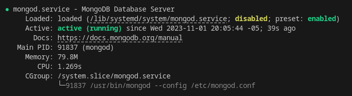

# Burguer Queen API

* [1- Docker](#1--docker)
* [2- Install MongoDB y Compass](#2--install-mongodb-y-compass)
* [3- Levanta la base de datos y servidor](#3--levanta-la-base-de-datos-y-servidor)

## 1- Docker

#### Prerequisites

#####  Upgrade my OS version to Debian 12 - Bookworn

I need to update my OS because I'm using Debian 10 (buster) so I need to full upgrade to 11 (bullseye) and then to 12 (bookworn) [Taked from cibercity](https://www.cyberciti.biz/faq/update-upgrade-debian-11-to-debian-12-bookworm/).

1. Backup the system
        `lsb_release -a`
        `uname -mrs`
        `cat /etc/debian_version`

2. Update existing packages and reboot the Debian 10 system.
        
    * Remove the non-debian packages to avoid errors (Check the documentation in the source of this info in cibercity)
        `sudo apt list '?narrow(?installed, ?not(?origin(Debian)))'`

        `sudo apt-forktracer | sort`

        `sudo apt-mark showhold | more`
        OR
        `sudo dpkg --get-selections | grep 'hold$' | more`
    Then you must delete or remove the host status for all listed packages one by one with the help of the following command:
        `sudo apt-mark unhold package_name`
        OR
        `echo 'package_name install' | sudo dpkg --set-selections`
        
    * 
        `$ sudo apt update`
        `$ sudo shutdown -r now`

3. Edit the file `/etc/apt/sources.list` using a text editor and replace each instance of `buster` with `bullseye`. Next find the update line, replace keyword `buster-updates` with `bullseye-updates` (same steps for Debian 12 with `bookworm-updates`). Finally, search the security line, replace keyword `buster-security` for `bullseye-security` (same steps for Debian 12 with `bookworm-security`).

4. Update the packages index on Debian Linux, run:
        `sudo apt update`

5. Prepare for the operating system minimal system upgrade, run:
        `sudo apt upgrade --without-new-pkgs`

6. Finally, update Debian 10 to Debian 11 Bullseye by running:
        `sudo apt full-upgrade`

7. Reboot the Linux system so that you can boot into Debian 11 Bullseye

8. Verify that everything is working correctly.

### Install [Docker Desktop](https://docs.docker.com/get-docker/)

#### Add Docker's official GPG key:
sudo apt-get update
sudo apt-get install ca-certificates curl gnupg
sudo install -m 0755 -d /etc/apt/keyrings
curl -fsSL https://download.docker.com/linux/debian/gpg | sudo gpg --dearmor -o /etc/apt/keyrings/docker.gpg
sudo chmod a+r /etc/apt/keyrings/docker.gpg

#### Add the repository to Apt sources:
`echo \
"deb [arch="$(dpkg --print-architecture)" signed-by=/etc/apt/keyrings/docker.gpg] https://download.docker.com/linux/debian \
"$(. /etc/os-release && echo "$VERSION_CODENAME")" stable" | \
sudo tee /etc/apt/sources.list.d/docker.list > /dev/null`
        
`sudo apt-get update`

You have now successfully installed and started Docker Engine.!!!

##### Optionalley: If you want to run docker commands as non-root user

[docker: linux postinstall](https://docs.docker.com/engine/install/linux-postinstall/)

##### Check the installed version

`docker compose version`

`docker --version`

`docker version`

#### Install AppIndicator and KStatusNotifierItem 

For a Gnome Desktop environment, you must also install AppIndicator and KStatusNotifierItem [Gnome extensions](https://extensions.gnome.org/extension/615/appindicator-support/)

### Image of MongoDB

In this project we wil use a [mongoDB image](https://hub.docker.com/_/mongo)

## 2- Install MongoDB y Compass

### Install MongoDB

### 1. Import the public key used by the package management system

From a terminal, install `gnupg` and `curl` if they are not already available:

`sudo apt-get install gnupg curl`

To import the MongoDB public GPG key from [url](https://pgp.mongodb.com/server-7.0.asc), run the following command:

`curl -fsSL https://pgp.mongodb.com/server-7.0.asc | \
sudo gpg -o /usr/share/keyrings/mongodb-server-7.0.gpg \
--dearmor`

### 2. Create a `/etc/apt/sources.list.d/mongodb-org-7.0.list` file for MongoDB

Create the list file using the command appropriate for your version of Debian:

`echo "deb [ signed-by=/usr/share/keyrings/mongodb-server-7.0.gpg ] http://repo.mongodb.org/apt/debian bookworn/mongodb-org/7.0 main" | sudo tee /etc/apt/sources.list.d/mongodb-org-7.0.list`

### 3. Reload local package database

Issue the following command to reload the local package database:

`sudo apt-get update`

### 4. Install the MongoDB packages

You can install either the latest stable version of MongoDB or a specific version of MongoDB.

#### Install the latest version of MongoDB

To install the latest stable version, issue the following

`sudo apt-get install -y mongodb-org`

Optional. Although you can specify any available version of MongoDB, apt-get will upgrade the packages when a newer version becomes available. To prevent unintended upgrades, you can pin the package at the currently installed version:

`echo "mongodb-org hold" | sudo dpkg --set-selections`
`echo "mongodb-org-database hold" | sudo dpkg --set-selections`
`echo "mongodb-org-server hold" | sudo dpkg --set-selections`
`echo "mongodb-mongosh hold" | sudo dpkg --set-selections`
`echo "mongodb-org-mongos hold" | sudo dpkg --set-selections`
`echo "mongodb-org-tools hold" | sudo dpkg --set-selections`

#### Run MongoDB Community Edition

##### ulimit Considerations

Most Unix-like operating systems limit the system resources that a process may use. These limits may negatively impact MongoDB operation, and should be adjusted. See UNIX ulimit Settings for the recommended settings for your platform.

**Note:** Starting in MongoDB 4.4, a startup error is generated if the ulimit value for number of open files is under 64000.

In may case, I'm using the operating system's built-in `systemd (systemctl)` acording to the output od this command `ps --no-headers -o comm 1`

##### 1. Start MongoDB.

You can start the `mongod` process by issuing the following command:

`sudo systemctl start mongod`

If you receive an error similar to the following when starting mongod:

`Failed to start mongod.service: Unit mongod.service not found.`

Run the following command first:

`sudo systemctl daemon-reload`

Then run the start command above again.

##### 2. Verify that MongoDB has started successfully.

`sudo systemctl status mongod`

You can optionally ensure that MongoDB will start following a system reboot by issuing the following command:

`sudo systemctl enable mongod`

##### 3. Stop MongoDB.

As needed, you can stop the `mongod` process by issuing the following command:

`sudo systemctl stop mongod`

##### 4. Restart MongoDB.

You can restart the `mongod` process by issuing the following command:

`sudo systemctl restart mongod`

You can follow the state of the process for errors or important messages by watching the output in the `/var/log/mongodb/mongod.log` file.

##### 5. Begin using MongoDB.

Start a `mongosh` session on the same host machine as the `mongod`. You can run `mongosh` without any command-line options to connect to a `mongod` that is running on your localhost with default port 27017.

`mongosh`

For more information on connecting using `mongosh`, such as to connect to a `mongod` instance running on a different host and/or port, see the mongosh documentation.

To help you start using MongoDB, MongoDB provides [Getting Started Guides](https://www.mongodb.com/docs/manual/tutorial/getting-started/#std-label-getting-started) in various driver editions. For the driver documentation, see [Start Developing with MongoDB](https://api.mongodb.com/?_ga=2.215171479.1643961160.1698885208-1190458327.1698885174).

### Install Compass

#### 1. Download [MongoDB Compass (GUI)](https://www.mongodb.com/try/download/compass)

Check your OS and for debian take care, don't install the arm version, download the Ubuntu 64-bit (16.04+) with extension `.deb`. 

`wget https://downloads.mongodb.com/compass/mongodb-compass_1.40.4_amd64.deb`

Then, install it:

<!-- `sudo dpkg -i mongodb-atlas-cli_1.12.2_linux_x86_64.deb` -->

`sudo dpkg -i mongodb-compass_1.40.4_amd64.deb`

Finally, start MongoDB Compass

`mongodb-compass`

### MongoDB Compass con Docker

#### 1. Pull the MongoDB Docker Image

`docker pull mongodb/mongodb-community-server`

#### 2.Run the Image as a Container

`docker run --name mongo -d mongodb/mongodb-community-server:latest`

#### 3. Check that the Container is Running

`docker container ls`

#### 4. Connect to the MongoDB Deployment with `mongosh`

Open an interactive container instance of mongo and connect to the deployment with `mongosh`.

`docker exec -it mongo mongosh`

#### 5. Validate Your Deployment

To confirm your MongoDB instance is running, run the `Hello` command:

`db.runCommand(
   {
      hello: 1
   }
)`

The result of this command returns a document describing your `mongod` deployment:

`{
   isWritablePrimary: true,
   topologyVersion: {
      processId: ObjectId("63c00e27195285e827d48908"),
      counter: Long("0")
},
   maxBsonObjectSize: 16777216,
   maxMessageSizeBytes: 48000000,
   maxWriteBatchSize: 100000,
   localTime: ISODate("2023-01-12T16:51:10.132Z"),
   logicalSessionTimeoutMinutes: 30,
   connectionId: 18,
   minWireVersion: 0,
   maxWireVersion: 20,
   readOnly: false,
   ok: 1
}`

## 3- Levanta la base de datos y servidor

Podemos decir que este proyecto tiene dos "servicios", uno es la base de datos para almacenar los productos, usuarios, etc., y el otro es el servidor para exponer el API.

Estos servicios tienen que estar corriendo, para que el API pueda funcionar.

Correr el servidor es bien simple: con `npm start` va a ejecutar `index.js` que tiene la lógica básica de un servidor con express.

Cómo levantar el servidor, este depende de tu instalación y sistema. Por ejemplo, en MacOS si instalaste con homebrew, puede usar brew services start mongodb-community@6.0 para levantarlo. O sin homebrew, mongod --config /usr/local/etc/mongod.conf --fork. En Windows, hay que levantarlo desde Services console.

Revisa la guía de instalación de , guía de instalación de Windows, o tu instalación en particular, para ejemplos en cómo levantarlo.

Check the [Guide for mongodb](./guides/GETTING-STARTED-DOCKER.md)